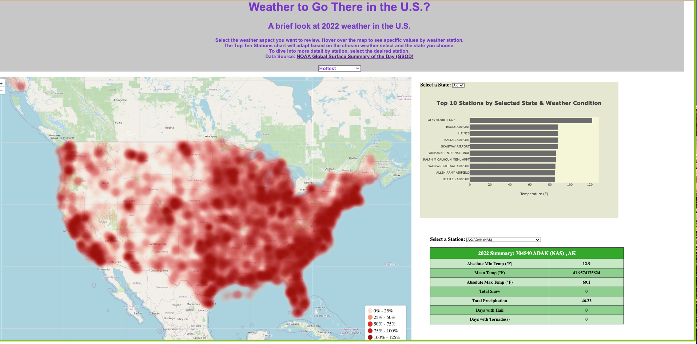
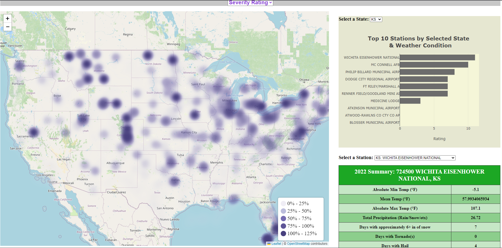

# Weather to Go There?
A dashboard for a user to investigate U.S. weather to help determine whether to visit or move to a location in the U.S. based on 2022 weather data from NOAA Global Surface Summary of the Day (GSOD). 

# Features
* Use SQL queries and python transformation to get the following data by weather station in the U.S.
  * Station ID, name, state, lattitude, longitude, elevation
  * Absolute minimum temperature in 2022
  * Absolute maximum temperature in 2022
  * Mean temperature in 2022
  * Total precipitation in 2022
  * Total snowfall in 2022 (approximation based on day-to-day snow depth changes)
  * Severity Rating using the following
    * Number of days in 2022 with high precipitation (> 6")
    * Number of days in 2022 with high snowfall (> 6", approximation based on day-to-day snow depth changes)
    * Number of days in 2022 with a tornado
    * Number of days in 2022 with hail
* Using html, javascript, css, and flask create the following visuals
  * Weather dropdown allowing user to select from key weather aspects across visuals (Hottest, Coldest, Severity)
  * Heatmap centered on the U.S. with 
    * layers that reflect absolute minimum temperature, absolute maximum temperature, and severity rating
    * pop-ups for each station that provide station ID, name, sState, and measurement relevant to the layer
    * updates based on weather dropdown
  * Top 10 table with dropdown to select state (user wants to investigate a state after viewing the heatmap)
    * populate state dropdown with all U.S. state abbreviations
    * populate top 10 stations within the selected state for the weather aspect selected in the weather dropdown
      * e.g. When Coldest and VA are selected, the top 10 chart shows the 10 stations with the coldest absolute minimum temperatures
  * Station table with dropdown to select a station (user wants to investigate a station after viewing the heatmap & state top 10)
    * populate station dropdown with all U.S. stations: state, ID, name
    * populate the table with the following data: absolute min temp, mean temp, absolute max temp, total snow, total precipitation, days with hail, days with tornados

Starting Page: <br> 
Severity View: <br> 

# File Notes
**Main Branch**
* app.py contains the flask calls wrapping our webpage code to call it via terminal (contributor(s): Tait, Rebekah)
* templates folder contains the index.html file as the core webapge (contributor(s): Rebekah, Angelo, Tait)
* static/js folder contains the logic javascript file called by the index.html
  * Heatmap (contributor(s): Angelo)
  * Top 10 chart (contributor(s): Rebekah)
  * Station Table (contributor(s): Tait)
  * Integration (contributor(s): Rebekah)
* static/css folder contains the css to style the website (contributor(s): Angelo, Tait, Rebekah)
* static/py folder contains the jupyter notebook with the SQL queries, transformation efforts, and file exports to provide data for the js scripts
  * noaa-bigquery-scripts.ipynb (contributor(s): Max, Mauricio, Rebekah)
* static/data folder contains the data exported by the python code doing SQL queries and referenced by the javascript
  * stations_all.js is exported by the python code to contain all the data required by the javascript
  * stations_all.csv and stations_all.json contain the same data as stations_all.js but in other formats for readability in different ways
  * stations_prcp_detail.csv and stations_prcp_detail.json are exported for a time intensive query for precipitation so the data can be pulled in future sessions without redoing the query
* WeatherToGoThereProposal.pdf is our initial proposal
* WeatherToGoThereProposalUpdate.pdf is out updated proposal after completing some more Leaflet heatmap research
* WeatherPresentation.pdf is our final presentation

**Prototyping Branch**
<br>Research contributions: Angelo, Rebekah, Tait, Mauricio, Max

# References
* NOAA Global Surface Summary of the Day (GSOD) https://www.ncei.noaa.gov/access/metadata/landing-page/bin/iso?id=gov.noaa.ncdc:C00516
* Big Query calls adapted from https://www.kaggle.com/code/crained/noaa-dataset-with-google-bigquery
* SQL calls adapted from GitHub BigQuery documentation: https://github.com/googleapis/python-bigquery
* ChatGPT and GoogleBard to troubleshoot, help with syntax 
 

# Getting Started

## Prerequisites
To display the webpage locally, you must have an environment with conda, python, flask, and a web browser. Then follow the Cloning Repo & displaying the Webpage Locally details.<br>
In addition, if you want to run the jupyter notebook, your environment will require jupyter notebook and you will need to have a google account with with BigQuery project per the instructions within the jupyter notebook.

## Cloning Repo & Displaying the Webpage Locally
```
git clone https://github.com/TechMax14/Project-3.git
```
```
cd Project-3
```
```
flask run
```

open http://127.0.0.1:5000 in a local browser

# Built With
* Python v3.10.11
* jupyter notebook v6.5.2
* jupyterlab v3.6.3
* conda v23.5.0
* flask 2.2.2
* html
* javascript
* D3 library https://d3js.org/d3.v7.min.js
* Plotly https://cdn.plot.ly/plotly-latest.min.js
* Leaflet library https://unpkg.com/leaflet@1.9.4/dist/leaflet.js 
* Masonry library https://masonry.desandro.com/ 
* BigQuery Python API https://cloud.google.com/bigquery/docs/sandbox 


**Python Modules**
* pandas v1.5.3
* json v2.0.9


# Group Notes for Git usage

## Cloning Repo:
- Open git bash and CD to the desired location to clone our repo (i.e. `cd C:/Documents/Bootcamp/Project3`).
- Then run the clone command: git clone https://github.com/TechMax14/Project-3.git
- That should be it!

## Pushing Code:
- Whenever one of us wants to push our code from our local computers up to the repo for everyone else to pull down and work on locally, follow these steps:
- Make sure that the new files/code you want to push up are in the repo location on your local machine (i.e. `C:/Documents/Bootcamp/Project3/Project-3`).
- Notice "Project3" is a folder that holds our repo "Project-3," sorry for the confusion lol.
- Then from that location run:
  ```
  git add .
  ```
- Check the status prior to see what files (in red) aren't pushed to the repo already (`git status`).
- Running `git status` after that should highlight the new files being ready to be committed in green.
- Next, run:
  ```
  git commit -m "Your message (i.e. 'Adding starter code to repo blah blah blah')"
  ```
- Last but not least, run:
  ```
  git push
  ```
- That should update our GitHub repo with whatever files/folders you just committed and pushed.
- We can discuss in meet-up sessions whether we want to create separate branches for each of us to work in, etc.
